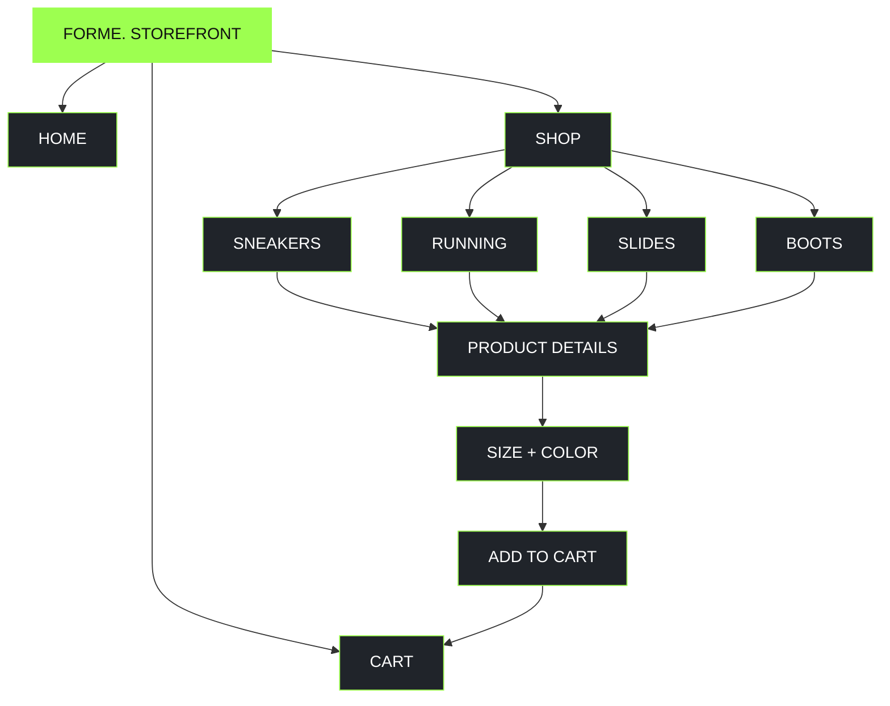
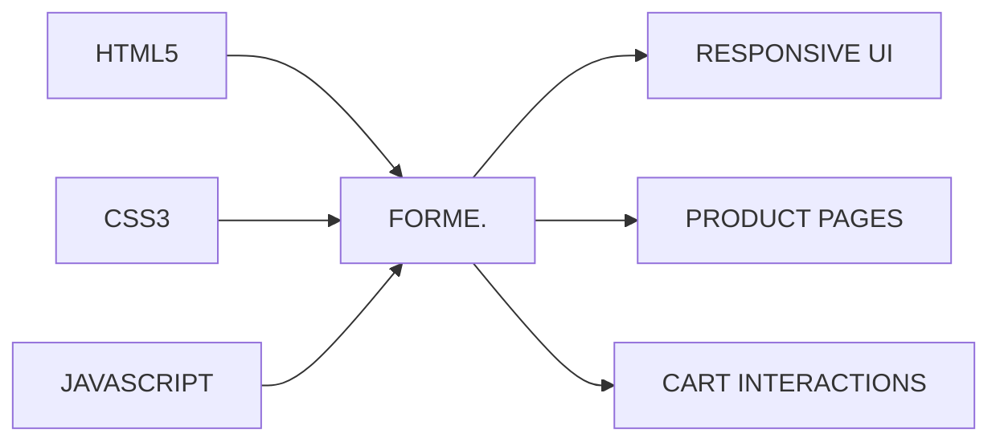
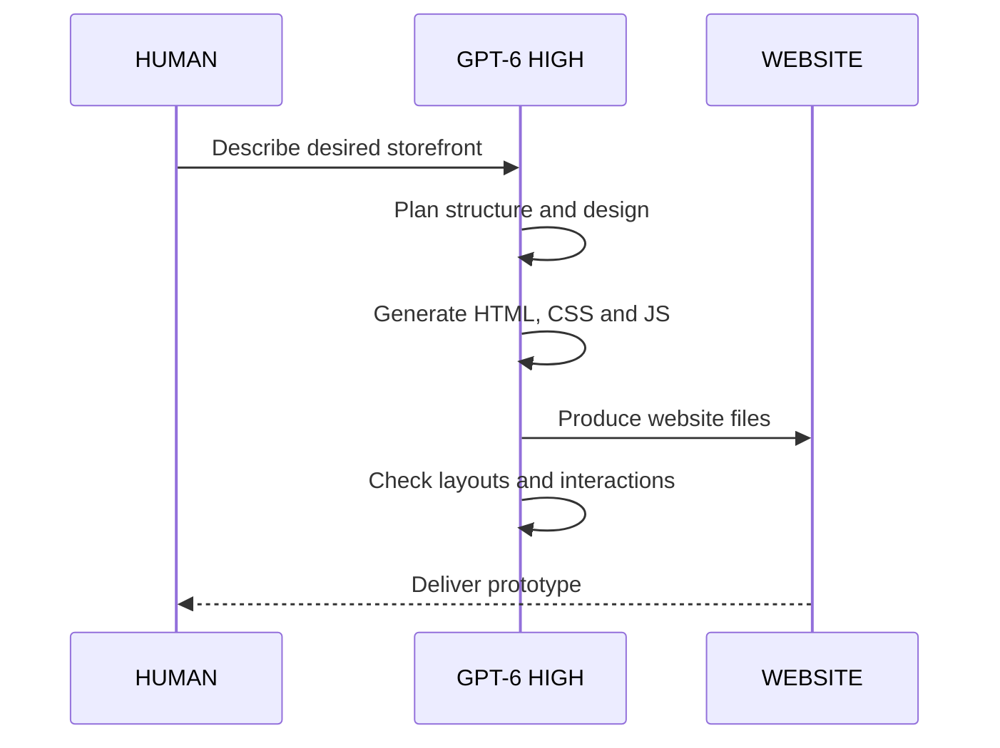

 <div align="center">

# F O R M E .

### M O V E &nbsp; D I F F E R E N T .

**A next-generation footwear storefront. Designed with glass. Built with intelligence.**


---

### HUMAN IMAGINATION × MACHINE INTELLIGENCE

*One prompt. An entire storefront.*

</div>

## 01 / THE EXPERIMENT

What happens when you give a powerful AI model a simple instruction?

> "Build me a shoe selling website. It should have multiple types of shoes, sneakers, slides, and each one should have its own page. Make it glassmorphism style."

**This is what happened.**

FORME. is a responsive, multi-page footwear storefront generated by **OpenAI GPT-6 using High thinking effort**.

No manually written source code by the repository owner.

No traditional development process.

Just a human idea translated into a functional front-end prototype by artificial intelligence.

## 02 / THE INTERFACE

<div align="center">

### DESKTOP EXPERIENCE


### MOBILE EXPERIENCE


### PRODUCT EXPERIENCE


</div>

## 03 / SYSTEM CAPABILITIES

| Module | Implementation |
|:--|:--|
| Product catalog | 12 individual products |
| Categories | Sneakers, Running, Slides, Boots |
| Product pages | Dedicated URLs for each product |
| Shopping cart | Quantity management and subtotal |
| Search | Product discovery |
| Sorting | Price and name |
| Customization | Size and color selectors |
| Favorites | Product wishlisting |
| Design system | Glassmorphism and gradients |
| Responsive layout | Desktop and mobile |

## 04 / ARCHITECTURE



### Technology stack



The project uses native web technologies without requiring a front-end framework.

## 05 / THE DESIGN LANGUAGE

**GLASS. DEPTH. MOTION.**

FORME. explores a futuristic interface combining translucent surfaces, blurred backgrounds, subtle borders, and vibrant accents.

| Design element | Direction |
|:--|:--|
| Primary background | Deep charcoal |
| Accent | Electric lime |
| Panels | Frosted glass |
| Typography | Modern sans-serif |
| Motion | Smooth transitions |
| Layout | Responsive product grid |

The goal was to make a conventional shopping experience feel like a premium digital product.

## 06 / RUN THE EXPERIMENT

Clone the repository:

```bash
git clone https://github.com/22davidd/forme-store.git
```

Replace the URL if your repository uses a different name.

Enter the directory:

```bash
cd forme-store
```

Start a development server:

```bash
python3 -m http.server 8000
```

Open:

```text
http://localhost:8000
```

No npm installation. No compilation. No build pipeline.

## 07 / THE GENERATION PIPELINE



### Authorship disclosure

**The source code in this repository was generated by OpenAI GPT-6 with High thinking effort.**

The repository owner provided the creative direction and original prompt, but did not personally write the website's implementation.

This repository is presented as an experiment in AI-assisted software generation, not as a claim of independent human programming work.

## 08 / WHAT THIS IS NOT

This is a front-end demonstration.

It does **not** include production payment processing, a live order backend, real inventory synchronization, or user authentication.

It should not be deployed as a real commercial store without additional engineering, security testing, and backend infrastructure.

## 09 / THE BIGGER PICTURE

```text
+---------------------------------------------------+
|                                                   |
|                 THE OLD WORKFLOW                  |
|                                                   |
|     IDEA -> DESIGN -> CODE -> TEST -> PRODUCT     |
|                                                   |
+---------------------------------------------------+

                        |
                        v

+---------------------------------------------------+
|                                                   |
|                  THE EXPERIMENT                   |
|                                                   |
|              HUMAN IDEA + GPT-6 HIGH              |
|                         |                         |
|                         v                         |
|                WORKING PROTOTYPE                  |
|                                                   |
+---------------------------------------------------+
```

FORME. demonstrates how generative AI can dramatically reduce the effort required to create a software prototype.

It does not eliminate the need for engineering judgment, verification, maintenance, or human creativity.

It changes how quickly an idea can become something tangible.

---

<div align="center">

### F O R M E .

**MOVE DIFFERENT.**

`HUMAN DIRECTED` · `AI GENERATED` · `GPT-6 HIGH`

**Made with OpenAI GPT-6 — High thinking effort.**

*The repository owner did not manually author the generated website code.*

</div>
